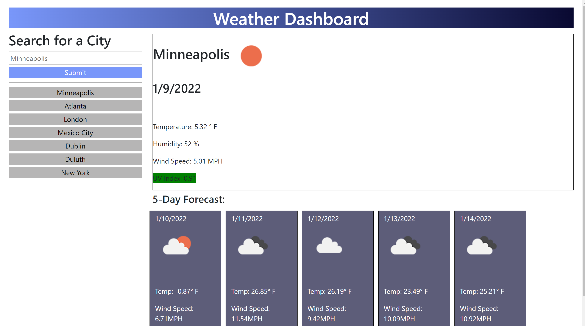

# Weather Dashboard

## Table of Contents
*[About the Project](About-the-Project)
*[View the Project](View-The-Project)
*[Challenges Faced](#Challenges-Faced)
*[What I Enjoyed!](#What-I-Enjoyed)
*[Credits](Credits)
*[MIT License](MIT-License)

## About the Project

I was asked to create a simple web application so that a user can view weather based on city input.

Current city view lists: city name, date, temperature, humidity, wind speed, and uv index. Beneath the current city view is a five day forecast for the same city displaying a smaller version of the same data on "daily" cards. The UV Index on current city has its own color flag based on whether UV conditions are favorable, moderate, or severe based on location.

Another unique feature is that local storage is used for web page persistence; if a client navigates away, any previous search can be viewable by button history beneath the city input form, and by clicking on a button element, the city will again load on to the current city weather pane and five day forecast.

## View the Project

https://crosenfrisk.github.io/weather-dashboard/

* My API call limit has been reached with my API key, so I am concerned about my user being able to see the data, but am hopeful the API key will reset its counter overnight so that any viewer using the Weather Dashboard starting on 1/10/2022 will have access to a certain number of calls again. The *freemium* version of the Open Weather API that I am using limits calls to 60 calls per minute (1,000 calls per day; and 1,000,000 calls per month). 

*There are a few workarounds that I have thought about now that my limit has been reached, one being implementing a local storage option which will minimize the number of times a fetch needs to be made by storing fetched data, setting an expiration timer for an hour -- or whatever increment  -- before refreshing the data (I don't yet know how to do this or I would have implemented it already ). A short-term workaround could be getting a new API key by creating another account with Open Weather, but a better long-term solution would be to pay for a subscription, but I would only do this if I were to publish the app for consumer use or if the client could be billed for the expense.*

## Challenges Faced

I struggled for a bit with local storage, but once I figured out that I need to save the cities to an empty array, the issue of keeping track of a user's search history got easier! 

I decided to limit the number cities saved to the array, so that the array did not get too large, and so pushed items are removed, starting with the oldest record once the list reaches a length of 8. This also helps with the create history buttons, so saved item buttons do not display ad infinitum.on the screen causing an eye sore. 

I also wanted to make sure that if a user typed the same city in the input box, that the input data would not populate the array with more than once, so logic was implemented to prevent that situation from occuring.

## What I Enjoyed

I had a lot of fun creating elements and making them appear dynamically for this project. My favorite part was finding all the parts of the API that would be useful to display such as temperature, humidity, wind speed, uv index, as well as the weather icons; once all the pieces were identified, getting them to load where I wanted to in the html was a breeze.

## Credits

* [Converting a unix timestamp into date using Vanilla JavaScript](https://coderrocketfuel.com/article/convert-a-unix-timestamp-to-a-date-in-vanilla-javascript)
* [How to use fetch() to make multiple API calls](https://gomakethings.com/how-to-use-the-fetch-method-to-make-multiple-api-calls-with-vanilla-javascript/)

* [Open Weather: Current Weather API -- used for weather information by city for current day and five day forecast](https://openweathermap.org/current)
* [Open Weather: One Call API -- used for UV Index](https://openweathermap.org/api/one-call-api#parameter)

## MIT License

Permission is hereby granted, free of charge, to any person obtaining a copy of this software and associated documentation files (the "Software"), to deal in the Software without restriction, including without limitation the rights to use, copy, modify, merge, publish, distribute, sublicense, and/or sell copies of the Software, and to permit persons to whom the Software is furnished to do so, subject to the following conditions:

The above copyright notice and this permission notice shall be included in all copies or substantial portions of the Software.

THE SOFTWARE IS PROVIDED "AS IS", WITHOUT WARRANTY OF ANY KIND, EXPRESS OR IMPLIED, INCLUDING BUT NOT LIMITED TO THE WARRANTIES OF MERCHANTABILITY, FITNESS FOR A PARTICULAR PURPOSE AND NONINFRINGEMENT. IN NO EVENT SHALL THE AUTHORS OR COPYRIGHT HOLDERS BE LIABLE FOR ANY CLAIM, DAMAGES OR OTHER LIABILITY, WHETHER IN AN ACTION OF CONTRACT, TORT OR OTHERWISE, ARISING FROM, OUT OF OR IN CONNECTION WITH THE SOFTWARE OR THE USE OR OTHER DEALINGS IN THE SOFTWARE.

Copyright &copy;2021 Claire Rosenfrisk